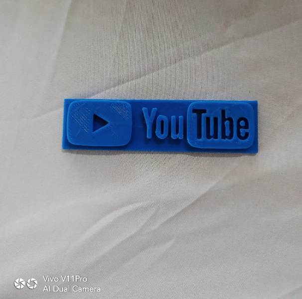

#####3D Printer#####
# This is an 3d Printer<h1>

3D printing is any of various processes in which material is joined or solidified under computer control to create a three-dimensional object, with material being added together , typically layer by layer. 

# Sindoh 3DWOX Printer Safety

1) The inside of the machine may be hot. To reduce the risk of injury from a hot component, allow some time to cool down.(Please be cautious of getting burns during printing as the Nozzle and the heating bed will maintain a high temperature of over 100 degrees.)
2) Do not put any portion of your body or objects on any part during machine operation as the motor and
 bed can be in very high temperature and can cause burns/injuries. Please be cautious.
3)  When the power is on, do not let any of your body touch the machine except the bed.If you have to touch the bed while the power is on, please do so after the bed temperature has been lowered to room temperature.
4) If you have to touch any parts other than the bed, please do so after the bed and nozzle temperature have been lowered to room temperature

## Operating Procedure
1) Place the machine in the dust free room and away from direct sunlight.
2) Power the machine and load the filament.Manually insert the filment cartridge in the machine.Then press cartridge in the touch screen and then press load and the  message is displayed and then press ok after confirmation.Now the filament is heated and reaches to the nozzle and heated upto the specified temperature and the filament is inserted in the heated nozzle.When this is done ok then message is displayed and screen return back to the home screen.
3)Now the machine can be directly connected to the wifi network after clicking settings and select the wifi option and insert the ip address details and click ok.
3)Now the Bed levelling is done by click setting->bed levelling and the bed is checked for the levelling.if the levelling is not ok then the screws on reight and left side of the bed appers in the screen and instructs to rotate clockwise or anticlockwise with displayed rotation to be made.after this is done and it is ok,the levelling process is finished and message regarding levelling don successfully is displayed.
4)It is to be remembered to place the levelling bed in the machine before printing any 3d model.
5)Now download and install the 3DWOX software and now select the 3d model and adjust the size according to the machine using the software.In my case I printed the 3D model of the Youtube logo which is displayed below...

