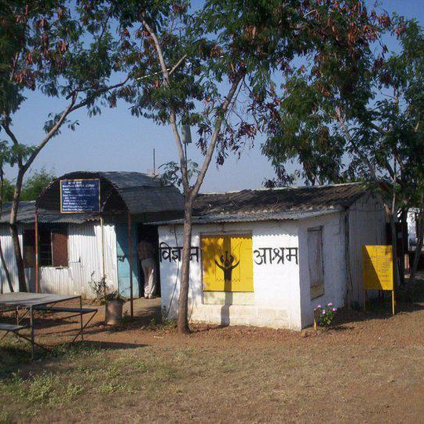
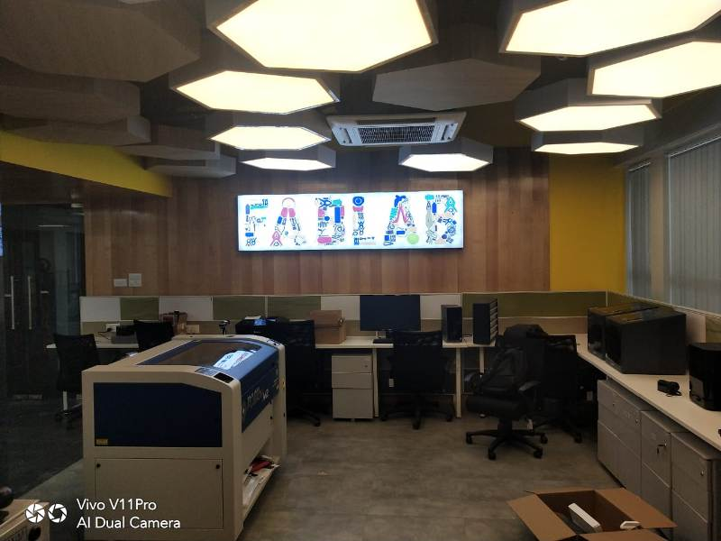
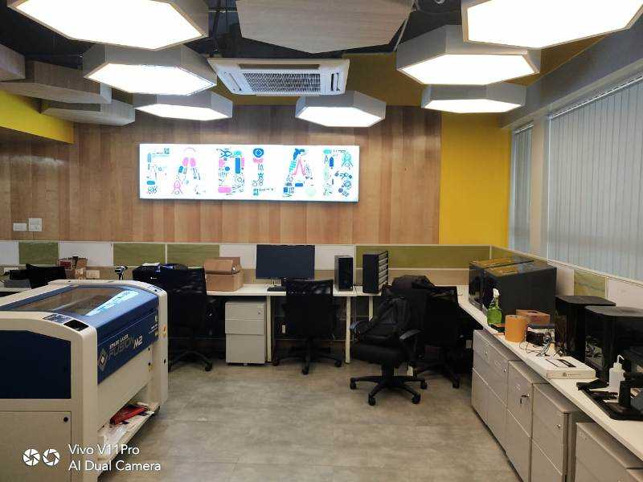

# Fablab Foundation
Formed in 2009 to facilitate and support the growth of the international fab lab network as well as the development of regional capacity-building organizations. The Fab Foundation is a US non-profit 501(c) 3 organization that emerged from MIT’s Center for Bits & Atoms Fab Lab Program. Our mission is to provide access to the tools, the knowledge and the financial means to educate, innovate and invent using technology and digital fabrication to allow anyone to make (almost) anything, and thereby creating opportunities to improve lives and livelihoods around the world. Community organizations, educational institutions and non-profit concerns are our primary beneficiaries.

The First Fab lab in India Vigyan located in village Pabal approx 70 kms from Pune   was the lab to be set up outside MIT. It was established in 2002 and received capital equipment by NSF-USA and IITK.

# About Me
I am Deepak Chaudhry .I Studied Bachelor Of Engineering in Electronics and Telecommunication from Government Engineering College,Rewa Madhya Pradesh.
[....continued](./aboutme.md)

# Inauguration of Fablab In STPI Bhubaneswar on 18/03/2019

## Day 1 Session 1 18/03/2019

 The Ianauguration of Fablab in STPI Elite Building ,Gothapatna was done on 18/03/2019.The Inauguration of the Fablab was done by Dr.Omkar Rai, (DG STPI) through VC from Delhi and here Sh Manas Panda Director, STPI Bhubaneswar was 
 [.....continued](./inaug.md)

 ## Day 1 Session 2
 The Training session 2 was started after lunchbreak in the training hall on 4th floor.The training was to be imparted by Mr.Sibu Saman from Kerela and Mr.Francisco Sanchez from Spain Barcelona.

 Mr.Francisco Sanchez            |  Mr.Sibu Saman
:-------------------------------:|:-------------------------------:
  |  

 

 Both are good personality and they are good instructor and teacher.
 1)Today we opened the account on the http://www.github.com and created the repository by name deepak_repo.

 2) Also downloaded and installed the visual Studio code.Now click on the extensions and serch for the codespell check and install it.

 3) Now Download git for windows and also downloaded git bash set the user email and user name .

 4) Now open github.com and clone and copy the url of your repository and now open the visual studio code and press control+p and type>git:clone and select git:clone and press enter and then paste the copied url and give the folder location to save the created repository in github.com
 5) Now edit the readme.md file and write it as instructed by the trainers.

 
 ## Day 2 Session 1      19/03/2019            
 On Day 2 we were all had the brief overview about all the machines in the fab lab.The fab lab at STPI Bhubaneswar Elite building looked like this...

 

 

The machines installed at Fablab Bhubaneswar are

*1)Roland Vinyl Cutter*

*2)Sindoh 3d Printer*

*3)Epilog Laser Cutter*

*4)Monofab Miller*

*5)Shopbot CNC Miller*

*6)Stratasys Polyjet 3 D Printer*

*7)SLA 3d Printer*

*8)Band Saw*

*9)Scroll Saw*

## Roland Vinyl Cutter
We studied about about the Roland Vinyl cutter. The Vinyl Cutter is a machine that allows users to cut materials such as vinyl, reflective vinyl sheet.

**Click here [here](./vinylcutter.md) for operating procedure of Roland Vinyl Cutter**

## Sindoh 3DWOX 3D Printer
Today we studied about the Sindoh 3DWOX DP200.Sindoh is known for its easy to use 3D printers. The DP200 has a built in camera which enables the user to check the print status remotely via laptop or phone.Click here 
[here](./3dprinter.md) for operating procedure of Sindoh 3DWOX DP200 3d printer.

## Epilog Laser Cutter
Today we learnt about the Epilog Laser cutter.Epilog's CO2 laser engraver machines provide a wide range of possibilities. The versatility and reliability of the laser machines is unparalleled in the ability to engrave and customize products made with wood, glass, stone, plastic, fabric, coated metal and much more! The ease of use, high precision and fast speed gives anyone from hobbyist to entrepreneur the ability to produce their idea and product. Designed to be as simple to use as a paper printer, you can create a design in a graphic software program and print it directly to the laser.Click here 
[here](./epiloglasercutter.md) for operating procedure of Epilog Laser Cutter.

## Monofab Miller
Today we learnt about the Monofab SRM-20 desktop miller.Desktop miller is used for the designing the circuit acording to our requirement and solder the components over the designed PCB and we tried to do some basic electronics production, specifically creation of a PCB by milling, then adding the components and finally burning the code to it. .Click here 
[here](./monofabmiller.md) for operating procedure of Monofab SRM-20 desktop miller.

## Shopbot CNC Miller
Today we learnt about the Shopbot CNC Miller .ShopBot miller, move a cutter around a big table (X and Y axes) and move it up and down as well (Z axis) allowing it to make 3D movements and cut all sorts of shapes. The cutter looks like a drill bit and is spun by a motor called a router or spindle. Unlike a drill bit, a router bit is designed to cut from the sides as well as the tip. By precisely moving the cutter through material, a ShopBot CNC tool can create virtually any pattern or shape and will do it in materials such as wood, plastic, foam, aluminum and many composites.. .Click here 
[here](./shopbot.md) for operating procedure of Shopbot CNC Miller.

## Stratasys Polyjet 3d Printer
Today we learnt about the Stratasys Polyjet 3D printer.This printer is used for high precision 3d prototype printing.In This liquid based polymer is used for printing.Polyjet (short for ‘photopolymer jetting’) 3D printers are a subclass of the Material Extruding / Jetting 3D Printers category. Material jetting is the name for any 3D printing technology that jets a liquid (the build material) from a print head, which is then solidified by UV light. In most material jetting processes, the build material is a photopolymer.
PolyJet 3D printers deliver high quality, multi-material printing and that too in multi-colour format.Click here [here](./stratasys.md) for operating procedure of Stratasys Polyjet 3d Printer.

## SLA (Stereolithography) 3d Printer ##
Today we learnt about the SLP 3d Printer.Stereolithography (SLA or SL; also known as stereolithography apparatus, optical fabrication, photo-solidification, or resin printing) is a form of 3D printing technology used for creating models, prototypes, patterns, and production parts in a layer by layer fashion using photochemical processes by which light causes chemical monomers to link together to form polymers. Those polymers then make up the body of a three-dimensional solid.Stereolithography can be used to create prototypes for products in development, medical models, and computer hardware, as well as in many other applications. While stereolithography is fast and can produce almost any design, it can be expensive. Click here [here](./sla.md) for operating procedure of Stereolithography 3d Printer.

## Band Saw ##
A bandsaw is a power saw with a long, sharp blade consisting of a continuous band of toothed metal stretched between two or more wheels to cut material. They are used principally in woodworking, metalworking, and lumbering, but may cut a variety of materials. Advantages include uniform cutting action as a result of an evenly distributed tooth load, and the ability to cut irregular or curved shapes like a jigsaw.[1] The minimum radius of a curve is determined by the width of the band and its kerf. Most bandsaws have two wheels rotating in the same plane, one of which is powered, although some may have three or four to distribute the load. The blade itself can come in a variety of sizes and tooth pitches (teeth per inch, or TPI), which enables the machine to be highly versatile and able to cut a wide variety of materials including wood, metal and plastic.Click here [here](./band.md) for operating procedure of Band Saw.

## Scroll Saw ##
A scroll saw is a small electric or pedal-operated saw used to cut intricate curves in wood, metal, or other materials. The fineness of its blade allows it to cut more delicately than a power jigsaw, and more easily than a hand coping saw or fretsaw. Like those tools, it is capable of creating curves with edges, by pivoting its table.The scroll saw's name derives from its traditional use in making scrollwork, sculptural ornaments which prominently featured scroll-head designs.While somewhat similar to a band saw, a scroll saw uses a reciprocating blade rather than a continuous loop. Like a hand coping saw, the scroll saw's blade can be removed and placed through a pre-drilled starting hole, allowing interior cutouts to be made without an entry slot. Also, the fineness in both width and tooth count of a scroll's blade permits significantly more intricate curves than even the narrowest gauge band-saw blade. Click here [here](./scroll.md) for operating procedure of Scroll Saw.

