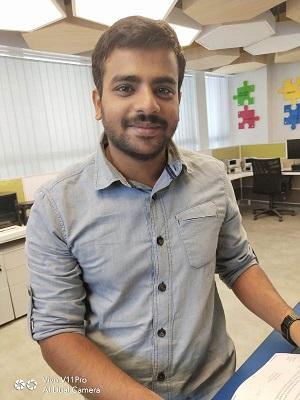

# Fablab Foundation
Formed in 2009 to facilitate and support the growth of the international fab lab network as well as the development of regional capacity-building organizations. The Fab Foundation is a US non-profit 501(c) 3 organization that emerged from MIT’s Center for Bits & Atoms Fab Lab Program. Our mission is to provide access to the tools, the knowledge and the financial means to educate, innovate and invent using technology and digital fabrication to allow anyone to make (almost) anything, and thereby creating opportunities to improve lives and livelihoods around the world. Community organizations, educational institutions and non-profit concerns are our primary beneficiaries.

The First Fab lab in India Vigyan located in village Pabal approx 70 kms from Pune   was the lab to be set up outside MIT. It was established in 2002 and received capital equipment by NSF-USA and IITK.

# About Me
I am Deepak Chaudhry .I Studied Bachelor Of Engineering in Electronics and Telecommunication from Government Engineering College,Rewa Madhya Pradesh.
[....continued](./aboutme.md)

# Inauguration of Fablab In STPI Bhubaneswar on 18/03/2019

## Day 1 Session 1 18/03/2019

 The Ianauguration of Fablab in STPI Elite Building ,Gothapatna was done on 18/03/2019.The Inauguration of the Fablab was done by Dr.Omkar Rai, (DG STPI) through VC from Delhi and here Sh Manas Panda Director, STPI Bhubaneswar was 
 [.....continued](./inaug.md)

 ## Day 1 Session 2
 The Training session 2 was started after lunchbreak in the training hall on 4th floor.The training was to be imparted by Mr. Sibu Saman from Kerela and Mr. Mr.Francisco Sanchez from Spain Barcelona.

 

 

 Both are good personality and they are good instructor and teacher.
 1)Today we opened the account on the http://www.github.com and created the repository by name deepak_repo.

 2) Also downloaded and installed the visual Studio code.Now click on the extensions and serch for the codespell check and install it.

 3) Now Download git for windows and also downloaded git bash set the user email and user name .

 4) Now open github.com and clone and copy the url of your repository and now open the visual studio code and press control+p and type>git:clone and select git:clone and press enter and then paste the copied url and give the folder location to save the created repository in github.com
 5) Now edit the readme.md file and write it as instructed by the trainers.

 
 ## Day 2 Session 1      19/03/2019            
 On Day 2 we were all had the brief overview about all the machines in the fab lab.The fab lab at STPI Bhubaneswar Elite building looked like this...

 

 

The machines installed at Fablab Bhubaneswar are

1)Roland Vinyl Cutter

2)Sindoh 3d Printer

3)Epilog Laser Cutter

4)Monofab Miller

5)Shopbot CNC Miller

6)Stratasys Polyjet 3 D Printer

7)SLA 3d Printer

## Day 2 Session 2      Roland Vinyl Cutter
We studied about about the Roland Vinyl cutter. The Vinyl Cutter is a machine that allows users to cut materials such as vinyl, reflective vinyl sheet.Click here 
[here](./vinylcutter.md) for operating procedure of Roland Vinyl Cutter

## Day 3    19/03/2019      Sindoh 3DWOX 3D Printer
Today we studied about the Sindoh 3DWOX DP200.Sindoh is known for its easy to use 3D printers. The DP200 has a built in camera which enables the user to check the print status remotely via laptop or phone.Click here 
[here](./3dprinter.md) for operating procedure of Sindoh 3DWOX DP200 3d printer. test

