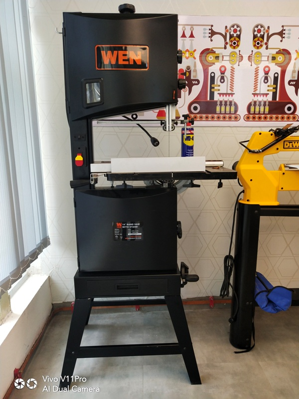

## This is Band Saw 

The bandsaw is useful for cutting stock to size and roughing out shapes. It contains a serrated blade that forms one continuous loop. The blade is stretched over two pulleys, the upper one idle, the lower one driven by a variable speed electric motor.This machine is generally used for curved designs and small wood designs.It is also be used to cut logs of wood

**Saftey Precautions**

1)Locate and ensure you are familiar with all machine operations and controls.

2)Ensure all guards are fitted, secure and functional. Do not operate if guards are missing or faulty. 

3)Check workspaces and walkways to ensure no slip/trip hazards are present. 

4)Ensure push stick is available. 

5)Lower the blade guide and guard to as close to workpiece as practicable. 

6)Start the dust extraction unit before using the machine. 

7)Unplug and lock-out machine before attempting any maintenance. 

**Operating Precautions** 

1)Keep hands away from the blade and cutting area. 

2)Feed the workpiece forward evenly and hold it firmly on the table to ensure effective control during cutting, while keeping hands in a safe position. 

3)Use a push stick when feeding material past the blade. 

4)Before making adjustments, switch off the saw and bring the machine to a complete standstill. 

5)Stop the machine before attempting to back the work away from the blade. 

**Dont Do Practices**

1) Do not use faulty equipment. Immediately report suspect machinery.  

2) Attempt to cut very small items. 

3) Cut cylindrical or irregular stock. 

4) Never leave the machine running unattended. 

5) Do not force a wide blade on a cut of small radius. Use relief cuts when cutting sharp curves.
