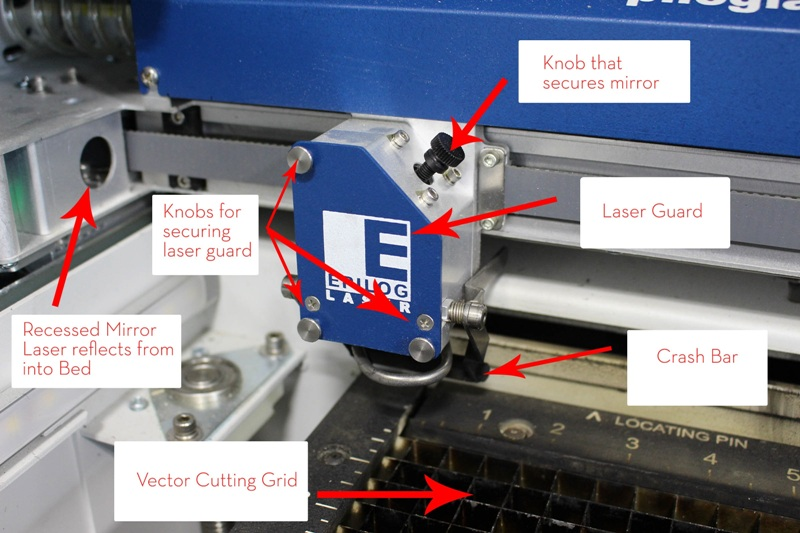
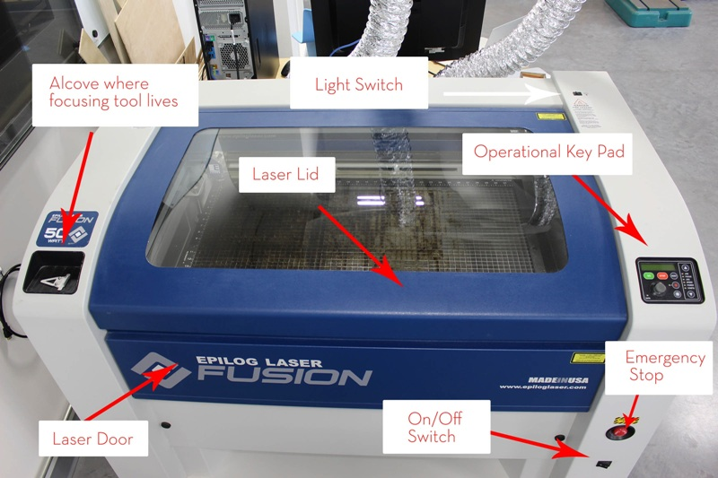
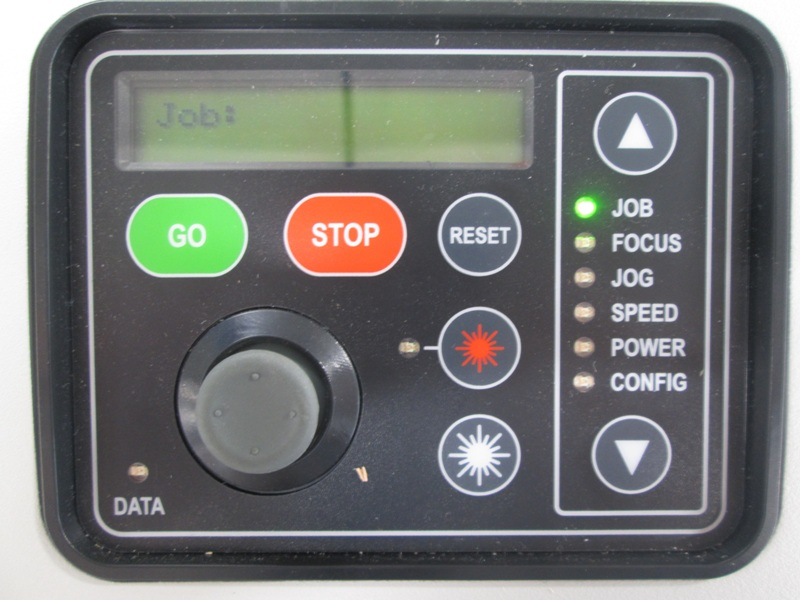
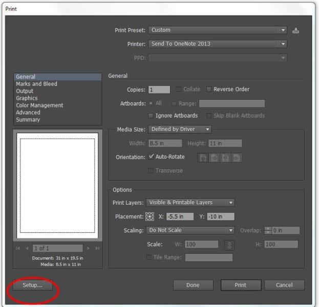
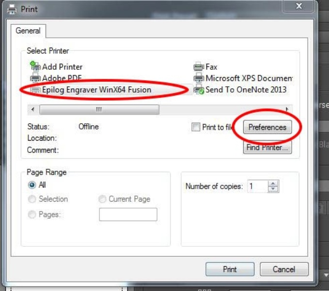
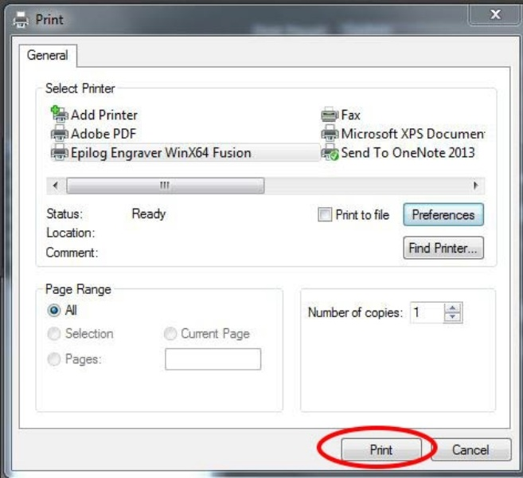

**Before Starting please check the following :-**

Personal Safety Check:
Closed Toed Shoes and Eye Protection because you are in the Wood Shop!

Machine Check:
1) Has someone left the rotary attachment in the laser?
2) Is all debris removed from the laser bed?
3) Are all of the guards attached that are necessary? 
4) Is the grid properly inserted in the slots?
5) Is this material allowed on this piece of equipment?

!!!NEVER LEAVE THE LASER CUTTER ALONE WHEN IT IS OPERATING!!!

Approved Materials:
! Acrylic/Plexiglass
! Plywood 1/8 ” – 1/4”
! Chipboard
! Mat Board
! Solid Wood (1/32”- 3/8”)
! Solid Wood (3/8” – thicker) Raster Only
! Poster Board
! Paper

Banned Materials
! Materials containing Chlorine (PVC, Moleskin)
! No Fiberglass

o 2” Flame is okay for short lengths during a cutting pass, anything
larger, pull the emergency stop button and turn off the ventilation
system if the flame is continuing for long passes.
o The laser will not fire if the lid is open or the front door is open.
However, the pointer will move through the motion of your print.
o Only use the chemical fire extinguished on the laser cutter that is
located by the door to the wood shop.
o Laser Cutter Bed is 32” x 20” (812.8 x 508 mm)
o The Laser Bed can lower to 14.25”.

Most inportant thing
## DO NOT FOR GET TO TURN ON THE VENTILATION!!!!!!

Getting Familiar with machine

Interior Components of laser cutter are as shown

Exterior Components of laser cutter are as shown

## How To use the machine

Step 1: 
Turn on the Laser. The Laser must always be turned on to receive your job.
        The switch is located on the front of the machine in the lower right hand 
        corner below the emergency stop button.

        
-The pointer will move and reset its position to home. The machine will
         go through an initializing process where green lights will run up and
         down on the control panel. When this is complete the operational
         keypad should read <JOB:> as shown in image below

Step 2: Setting up your file to print

1) Open your project using Adobe Illustrator
2) Make sure your project’s artboard is defined as the same size as your piece of material or the print bed 32” x 20”.
3) Your Artboard is the white area in your design in Illustrator.
3) Use the same measuring system throughout this project.

Step 3: Sending your Job to the Laser Cutter

1) Select File >> Print in Illustrator when your design work is complete and you are ready to use the laser
2) Make sure the correct print driver is selected, change from <Send to OneNote 2013> to <Epilog Engraver WinX64 Fusion>
3) Under Options, click on the upper most left side box in the placement area
4) Click on <Set-up> in the print driver

5) Click on <Preferences> to access the Epilog Laser Cutter Print Driver pre

6) Select your job type: <Raster>, <Vector>, or <Combined> as according to each individual project. If you click on Raster, the program will gray out the vector section.

a) Raster is for engraving
b) Vector is for cutting
c) Combined, will raster first then vector cut your file

7)Use the chart on the wall to enter the appropriate values for the Raster or Vector Settings. Remember these are recommended settings and can change from job to  job depending on, especially in wood, the quality of your material or use on the laser itself.

8) Set <Piece Size> according to the size of the artboard you are working on in your graphics software document.

9)  Make sure your DPI is set to 600 – if you adjust your DPI reference the recommended setting for that selected DPI.Your piece will only be able to cut out at 600DPI or greater for the recommended setting in Illustrator.
10) Change your engrave direction to your preference. Either <TopDown> or <BottomUp>. This will tell the laser which direction to start cutting your print.

11) Click <OK> when all of your settings are correct.
13)In the print driver click on <Print>.

14) In Adobe Illustrator’s Print Driver click <Print>
15)The control Panel Should now be displaying your job’s name. Note: the character limit for file names is very short.
16) It should now read <JOB: Title of piece>
17)• Below your job name there is also a time. This is an estimation of how long it will take for your job to run. Use common sense here and do not run into the next reservation.

Step 4: Place your material in the upper left hand corner of the print bed. Do not push down on the Vector Cutting Grid or place heavy material on the bed.

Step 5: Zero out your coordinate system, Setting you Origin

1) Turn on the Red Pointer by depressing the Red Star Button on the control panel.
2) Using the arrow buttons, toggle down to <Jog>
3) Use the joystick to move the laser print head around to a clean section of your material. If you are using a new piece of material, set your zero for optimal material usage for your desired project.
4) When you reach a location that will allow your entire project to be printed, click the joystick once and this will set your new home position.

Step 6: Focusing Your Laser

1) Open the lid of the laser and attach the manual focusing tool on the front of the print driver.
2) Using the arrow buttons, toggle down to <Focus>
3) Use the joystick, move the print driver up and down until the tip of the manual focus tool to resting gently on the surface of your material. 

**Helpful tip: Place your left index finger on the top of the manual focus tool and move the joystick with your right hand. Now you can feel when your material** **touches the tool**

4) When you reach the surface of your material with the manual focus tool click the joystick once and this will set your new focus position.
5) You may also double click the joystick. This will bring you to a new menu in your control panel. Flick the joystick to the left to set this position as your new focus point.)
6) Remove the manual focus tool and place it back in its home position. 
7) We only have 1 focusing tool. DO NOT LOOSE THIS TOOL!

***Focus raises and lowers the Laser Bed and Jog moves the laser lenses along the x & y coordinate system.***

Step 7: Turn on the Air Filtration System and Air Assist Pump
1) Turn on the air assist pump. This pump cools the laser when it is vector cutting. This pump must ALWAYS BE ON WHEN VECTORCUTTING. It is on the floor directly behind the laser.
2) Turn on the VENTILATION!!!!

Step 8: Printing your Project

1) Close the lid of the printer. Toggle back to <JOB>.
2) Hit the <GO> button on the control panel.
3) Hitting <STOP> will pause your print. Hit go again to resume your printing where is left off.
4) Hit the emergency stop button to cancel the print if there is a problem.
5) The lid and front panel need to be closed to engage the laser. IF you try printing with either of these doors open the laser will not fire and the print driver will go through ghost motions of your print.
6) When your print is finished. Wait a few seconds for the smoke to clear from the laser cutter. Jog the print head away from the piece so you do not accidentally hit it and open the lid and retrieve your project.

    