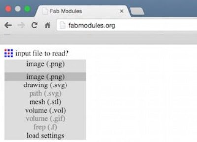

**Safety Precautions**

The Monofab SRM-20 CNc Desktop Miller is a highly powerful CNC, it can occasionally result in a lot of flying debris in the form of dust or small board pieces. Always wear safety goggles while operating the machine. And also never touch the drill bit or place your hands near the board while the spindle is active.

1)The milling bit might break off during operation, it’s always recommended to wear eye protection while.
2)Always vacuum the surface after cutting before operation and upon finishing.
3)The Moving cutting head can jam your hand between it and the enclosure, keep your hands away from the cutting area, when under operation.

**Setting Up the Sacrificial Layer**

We will be using a copper clad board as our sacrificial layer. We need a sacrificial layer here because in case something goes wrong and the milling bit goes further than expected, we might just end up damaging the base plate. The sacrificial layer as the name suggests sacrifices itself for saving the base plate from any damage.

To do this we apply the dual sided tape onto a copper clad board, about the same or of greater size to that of the plate we are going to mill. This would also help us when we are cutting the final board out. Make sure that when you place the board on the build plate you leave a 1 sqcm border. Make sure that the board is level and apply sufficient force above it to make it adhere to the base plate.

**Setting Up the PCB Board for Milling**

As we did before, apply the dual sided adhesive on the plate which is to be milled. Make sure that the adhesive is almost evenly placed so that the milling surface is level. Check out the figure below:

Now, place the board on the sacrificial layer, leaving a 1 sqcm border like before.

And now gently apply pressure on the board so that the board adheres to the sacrificial layer. Observe the milling surface to see if its level. If not try applying pressure gently on the raised areas, if that doesn’t work redo the adhesive part, making sure that its level and uniformly distributed. Once that’s done, your milling surface is ready.

**Attaching the Mill Bit to the PCB Miller**

Raise the milling head by using the ‘Tool-UP’ button on the SRM-20 front panel. Using the Allen key, gently loosen the hex nut on the rotating part on the milling head, and gently remove the existing bit.

Removing Bits                    |  Milling Bits
:-------------------------------:|:-------------------------------:
      |  

Depending on the type of cut you wish to make you will have to select from 2 available bits. 1/64 for the traces and 1/32 for the border cut. Make sure, while storing a bit, it should be placed in its appropriate container with the cap on.

**Setting Up the Fab Modules**

After making the board layout, you will have to export it as an image (.png) file, having black and white coloring. The black portion of the board is removed by the miller and the white portion remains as the circuit trace. An example of a PCB layout used for this miller:

 

Select ‘input format’ and then from the corresponding drop down, select image(.png). And Load your PCB trace from your local storage.

Note that the image should be in black and white, not color, not greyscale, but black and white. Where the white part determines your circuit. (You can always invert the image by clicking on the ‘invert image’ button if you require. Under the output format drop down select the ‘Roland Mill (.rml)’ option.

**Setting Up the Origin**

Next, you need to set the origin for the PCB miller or CNC. This is done so that the machine knows from where it should start the operation. This is also vital in order to select the desired area on the copper board on which you want the PCB to be made.

Now move the milling head down by using the ‘Tool-Down’ button on the front panel, till you reach about 0.5 cms above the milling surface.

Setting XY axis Zero             |  Setting Z Zero
:-------------------------------:|:-------------------------------:
           |  

**Start the PCB Milling**

Select the ‘PCB traces’ option under the ‘process’ drop down.In the fab modules select the machin to SRM-20 and set x0,y0,z0 to 0,0,0, and  adjust the cut depth to about 0.2-0.4mm, that seems to work great for me, but feel free to play around with it, since we have a sacrificial layer.

 

As seen above, select the ‘calculate’ option. This will generate the tool path for the device. Be patient as this might take some time.Now you could either make modifications to this and calculate again, and once you are happy with what you see, click the ‘save’ button.Now select the .rml file from pc and give output. ,it should start cutting. Be patient and wait till the entire cut has been finished. 

This is what it should look like, once it has completed the process:

 

But wait! Don’t remove the milled board just yet. Vacuum the surface and then closely observe the circuit and note the surface for any incomplete cuts. Incomplete traces should look like the shiny grooves on the above image. If so redo the entire circuit with a little more cut depth.

Once you are happy with the circuit, replace the bit with the 1/32 bit and repeat the same process with the border for cutting the board out. Be sure to use the ‘PCB outline’ option in the process dropdown. You have to use another .png file that looks like this to do the border cutting:

