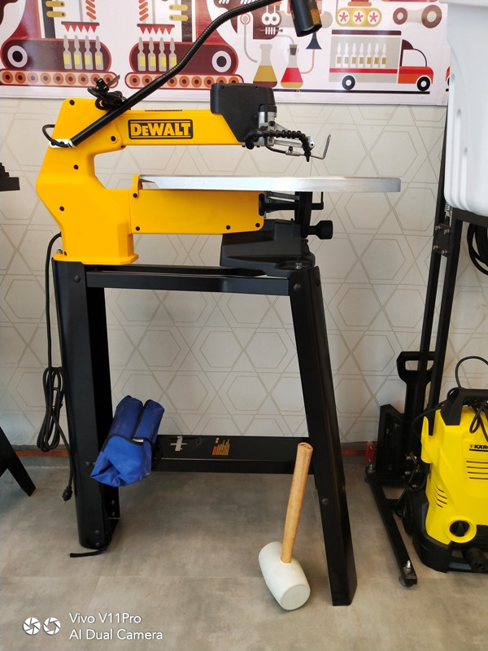

## This is Scroll Saw 

 Safty Precations
1.	Ensure the scroll saw is securely fixed on a stable and level surface. 

2.	Ensure the scroll saw is operated on an RCD protected circuit.

3.	Ensure the machine operator zone is clearly marked and no slip/trip hazards are present in workspaces and walkways.

4.	Check that the blade guard is securely fixed in position.

5.	Choose the correct size and style blade for the material and the type of cutting planned.

6.	Ensure the blade teeth point downward, toward the table.

7.	Tighten the blade securely in the chucks and adjust it in-line with the blade support.

8.	Ensure the blade tension is properly adjusted. If "knocking" is heard, readjust the tension.

9.	Locate and ensure you are familiar with the operation of the ON/OFF starter.

10.	Faulty equipment must not be used. Immediately report suspect machinery. 

##Operating Precautions

**Note Please:-Keep fingers and hands away from the path of the blade.**

1.	Use this scroll saw to cut only wood, manufactured boards, plastics and nonferrous metals.

2.	Do not hand hold pieces so small that your fingers will go under the blade guard. Use a jig to hold a small workpiece. 

3.	Ensure there are no nails or foreign objects in the part of the workpiece to be cut.

4.	Adjust the hold down foot so that it is pressing lightly on the work piece.

5.	Start the dust extraction unit before using the saw.

6.	Before starting the cut, watch the saw while it runs. If it makes an unfamiliar noise or vibrates excessively, stop immediately. Turn the saw off and isolate the machine. Do not restart until finding and correcting the problem.

7.	Allow the blade of the saw to reach full operating speed before starting the cut.

8.	Keep hands and fingers clear of the scroll saw point-of-operation.

9.	Do not force the tool. Firmly hold the workpiece with both hands and feed it at a moderate rate of speed into the blade.

10.	Keep your face and body to one side of the blade and out of line with a possible thrown piece if the blade should break.

11.	Turn off the machine and wait until it has completely stopped before removing scraps or making adjustments.

**When Scroll Saw Is nopt in use**

1.	Switch off the saw and reset all guards to a fully closed position.
2.	Leave the machine in a safe, clean and tidy state.
