## This is Shopbot CNC Milling Machine

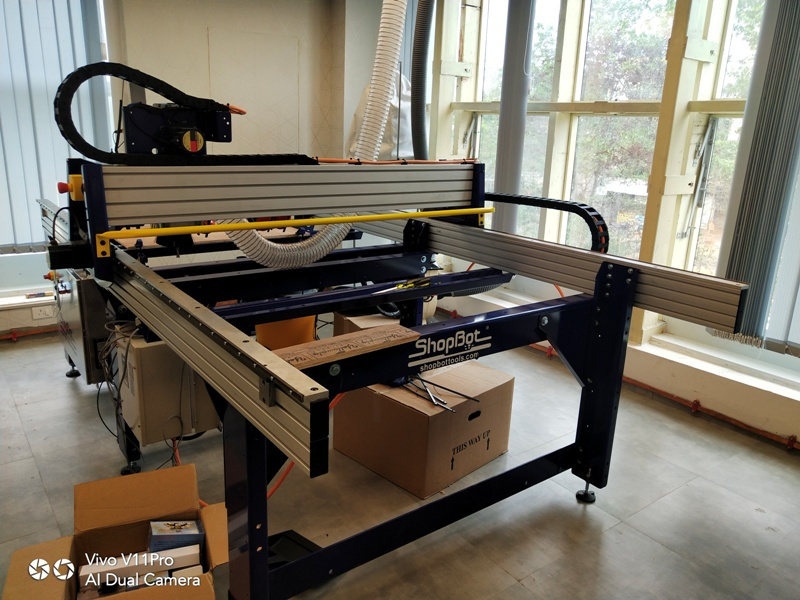

**SAFETY Precautions:** 
Always wear safety glasses and closed-toe shoes
Note:  The Help program in Partworks is actually quite helpful.  Feel free to use it to find out what any icon means and does.
1.  Log in to the shoptbot computer. 

2.  Open the program “Partworks 2D”

3.  Go to File:Open and open your DXF file.

4.  On Job Setup screen:

Units:Inches; 
Size:The size of your stock(x is the long axis on the machine.  This is marked on the aluminum inside rail of the Shopbot for reference); 
Material: Z-zero dot should be on the top of the part.  Measure the thickness of your stock with calipers and input it as the thickness.  Don’t trust the manufacturer on material thickness ; 
XY Origin Position: This is a user preference, we’ll use the bottom left corner.  
Turn off “Use origin offset.”  If your drawing and settings aren’t just right, this can cause the machine to try cutting in places you don’t want it to ; 
Data Scaling: You have the option to click “Center data in job” to easily center your part, or you can do this manually in a later step. This is shown in the screenshot, but was un-checked before OK was clicked. 

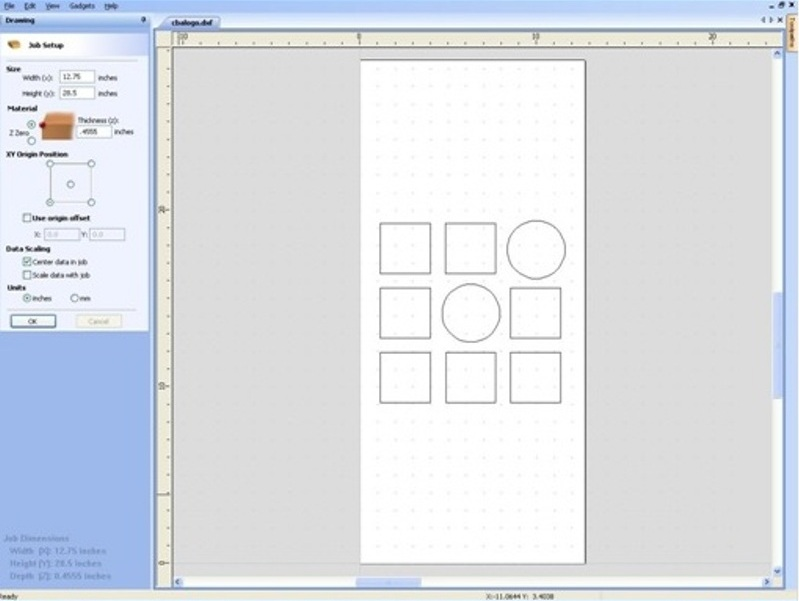

This covers this screen, so click OK at the bottom.

5.  On Drawing screen:  Under Edit Vectors Heading: Using the 3rd arrow tool from the left (Move, Scale, Rotate Selection) drag to select your entire part and fit it inside the white box that represents your stock.  This tool can resize or rotate by dragging square-marked and circle-marked corners, respectively, and move by dragging from the center of the part.
Under create vectors: Select “Draw Rectangle” and draw 2 rectangles, one larger than the other, just around the part.  This will allow us to create a pocket.  The outer box is selected in the screenshot, shown by a dashed line.  This is pretty difficult to see in the picture though.

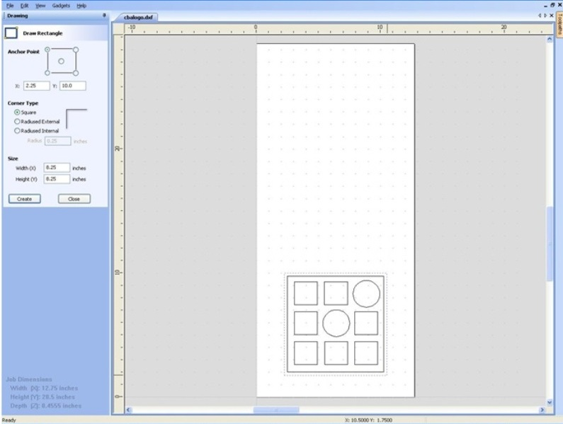

Note: Press fit parts require filleted slots on inside corners.  To achieve this, select the fillet tool under Edit Vectors, and select T-Bone Fillet.  Input your tool size, and click on two lines to create a fillet between them.
6.  First toolpath: The pocket in between the raised parts.  Select all the components of your parts, as well as the smaller, interior rectangle drawn around the parts. Do not select the exterior, cut-through rectangle.  This will come later.
Click on “Toolpath” tab on right side of screen.  Under “Toolpath Operations” select “Create Pocket toolpath.”
Start Depth: 0” (starting on top of material)
Cut depth: Choose a finished depth of cut.  Make sure you don’t make the cut so deep as to make the remaining material too thin and not sturdy, but do cut deep enough to be able to see what you’ve cut.  On this .375” thick piece of wood, we’re cutting our pocket to .125”;
Under Tool, click select.  A straight ⅛” 2 flute downspiral endmill is appropriate for this job.  In this Tool Database screen, select your tool from the list on the left.  Verify that the named diameter of your tool matches the Diameter listed under “Geometry.”  In this case, .125 inches.
        
Cutting parameters: 
Pass Depth: determines how much deeper the tool goes with each pass.  We’re using the tool diameter, which the Pass depth should not be greater than.                
Stepover: How much the tool will overlap on each pass when rastering a pocket.  We’re using .1”, which is 80%, a good standard for rough pocketing.
Spindle speed: We’re using 12000 RPM.  This is based on material, tool diameter, feed rate and number of flutes on the tool. Our material is plywood.
Feed Rate: We’re using 150 in/min.  This is a bit high, 
Plunge rate: We’re using 60 in/min.  
Click Apply, then OK.

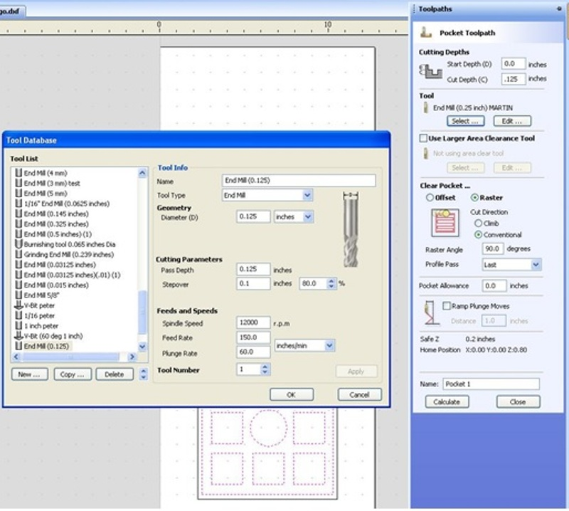

We’re choosing Raster, with cut direction Conventional, Raster angle at 90, and Profile pass as Last.

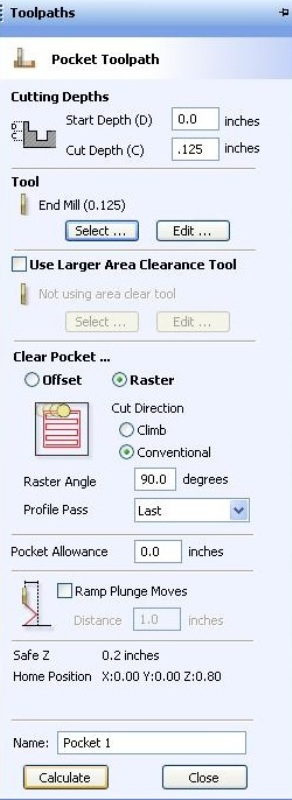

Click Calculate.

7.  Preview Screen:  Click the preview toolpath button to ensure that your part will be cut correctly.  If it looks good, notice the tabs at the top center of the screen, and click back to your DXF file.

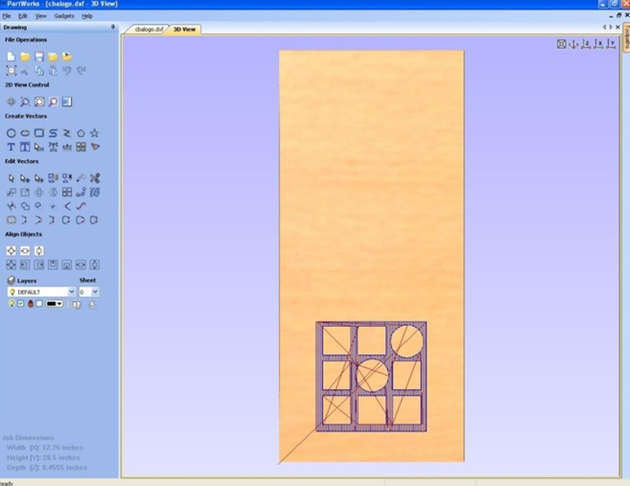

8.  We will now generate the toolpath to cut the part out of the material.  Select Your outer rectangle.  Click “Profile Toolpath” Under the Toolpaths tab.

Start Depth: 0”
Cut Depth: The thickness of your part, plus some extra to make sure it goes through.  For         our .375” part, we’re going with .38”

Select the same tool as for the pocket, with all the same settings.

Machine Vectors: Outside

Direction: Conventional.  Climb puts more stress on the motor and makes less accurate             parts, but can give a nicer edge finish.

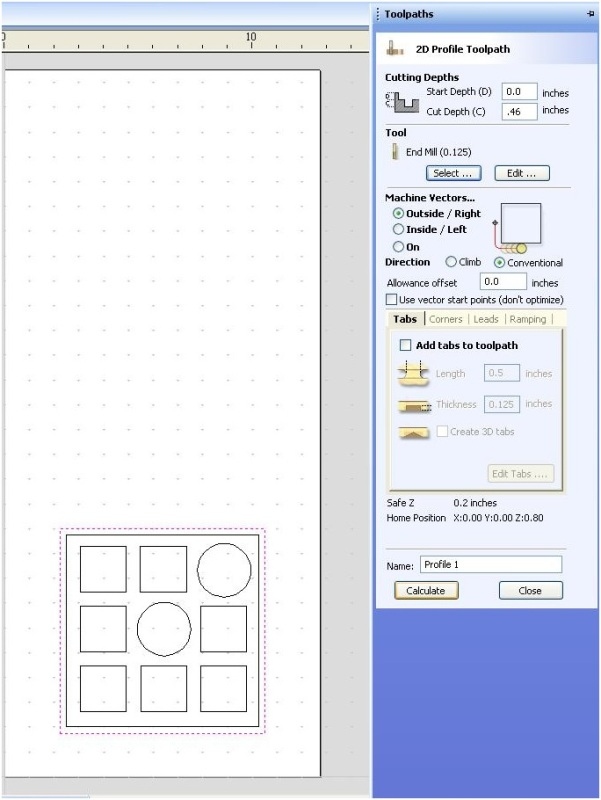

Click Calculate.  The program warns that your part will be cut through.  That’s the plan, so click OK.
Previewing the Toolpaths now should show what your finished part should look like.

9.  Under Toolpath Operations, Click Save Toolpath, the icon that looks like a floppy disk.  Because we’re using the same tool for all cuts, we can click the “Save all visible toolpaths to one file” button, but make sure that the cuts are listed in the correct order above this box before saving as such.  Make sure Post Processor is in “Shopbot(arcs)(inch)(w/speed)(*.sbp)”  Click Save Toolpath.  Name it.  Also, go to File:Save As and save your file as a Vcarve file for easy editing if necessary.

10.  Setting up the Shopbot: Select the appropriate collet for your tool.

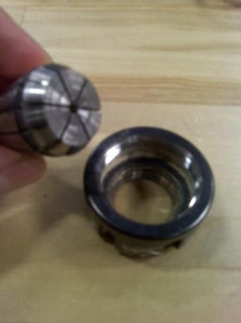

Push it into the collet holder (The black threaded ring) until it clicks.

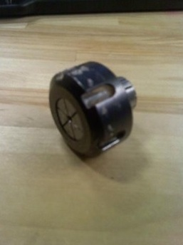

Start to thread the collet holder onto the spindle, one or two threads on.  Insert the tool into the hole in the collet.  Push it in until the flutes are almost touching the collet, but not.  Hand tighten the collet holder on the spindle.

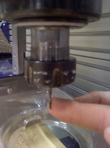

Grab the flat sides of the spindle with a 27 mm wrench.  Use the black ER25 Collet Wrench to grab the collet holder.  Using both of these, snug the collet holder onto the spindle.

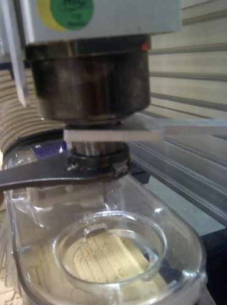

Raise the dust collection skirt up over the tool.  There is a thumb screw between the 2 springs behind the spindle to hold it in place.

Insert the key attached to the collet wrench into the keyhole on the control box (left side of the shopbot if sitting at computer) and turn it.  Turn on the control box with the big red switch.

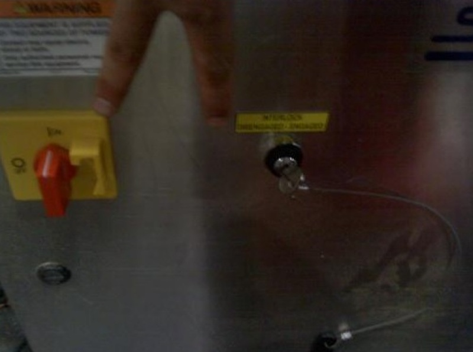

The machine won’t talk to the computer until you reset the drivers.  This is accomplished using the yellow control box with a big red button, a blue and a green button.  Press the blue button.

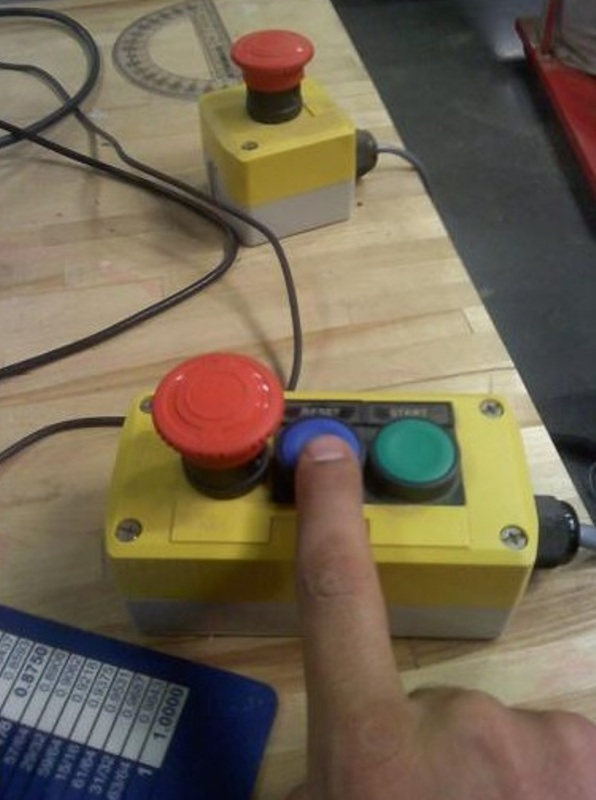

Attach material to bed using screws.  Make sure the piece is flat by either putting lots of pressure in the stock while screwing it down, or having clearance holes in the stock so it can be pulled flat to the bed.  Make sure to align your X and Y correctly.  Horizontal lines on your drawing are X, and they line up with the long axis on the cutting bed.  You can put the material wherever you like, as we will choose the origin later, but make sure the axes are lined up properly.  Also, be sure you don’t put any screws where the material will be cut, this will probably break your tool.

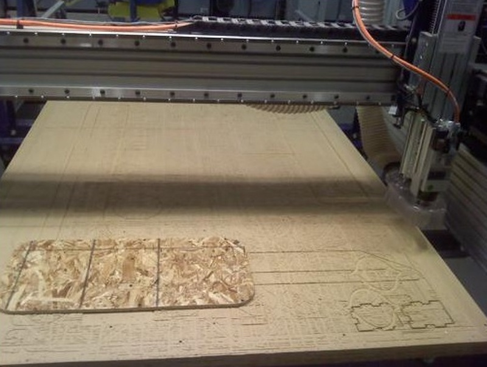

Open “Shopbot 3” on the desktop.
        
On the red Shopbot Position Window, locate the yellow “Show Keypad” button and click it.  We can now jog manually using the keyboard.  The arrow keys control X and Y, Pg Up and Pg Dn move Z.

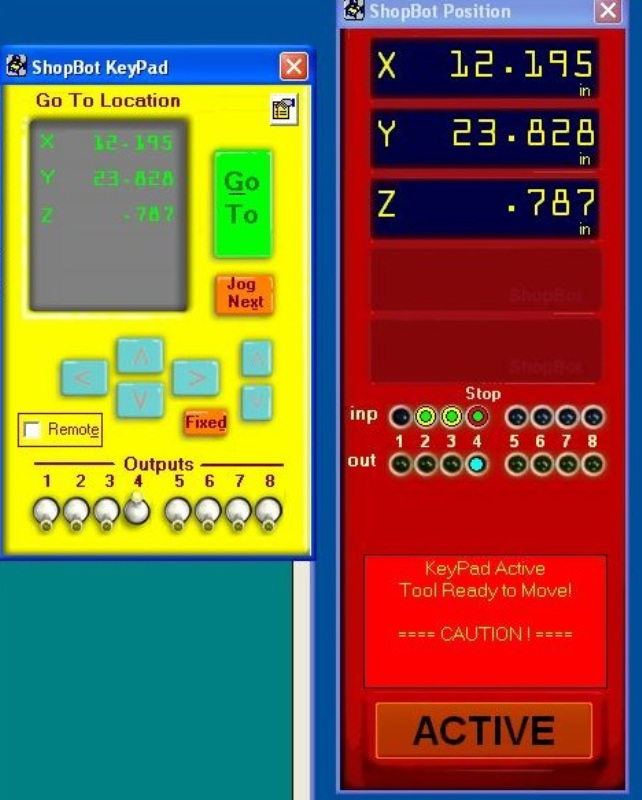

Move the tool over the material.  Lower the tool until it is a few inches away from the material. Remove the long metal plate from the side of the spindle holder and lay it flat on your stock, under the tool

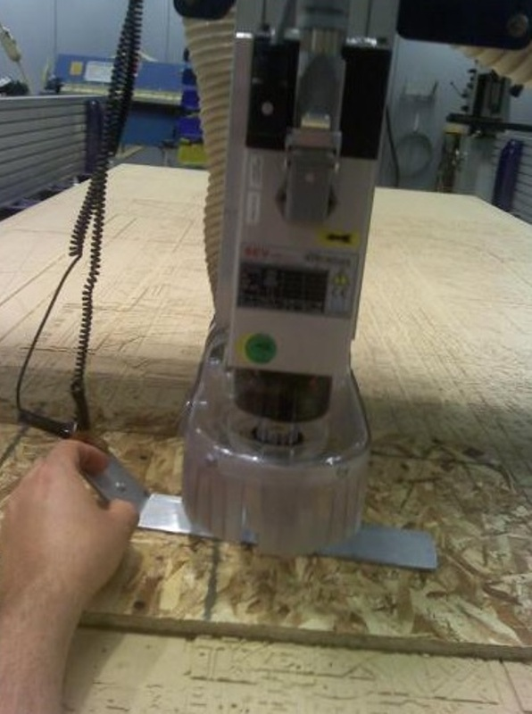

In the Shopbot Console, go to menu “Cuts” and run command “C2 - Zero Z axis w/ ZZero Plate.”  Click OK.  The machine automatically zeros the Z axis. Click OK after.  Return the metal plate to its holder on the side of the spindle.
Red window: Show keypad again.  Jog the tool so it is over the origin that you selected in step 4.  In our case, this is the bottom right corner of the stock.

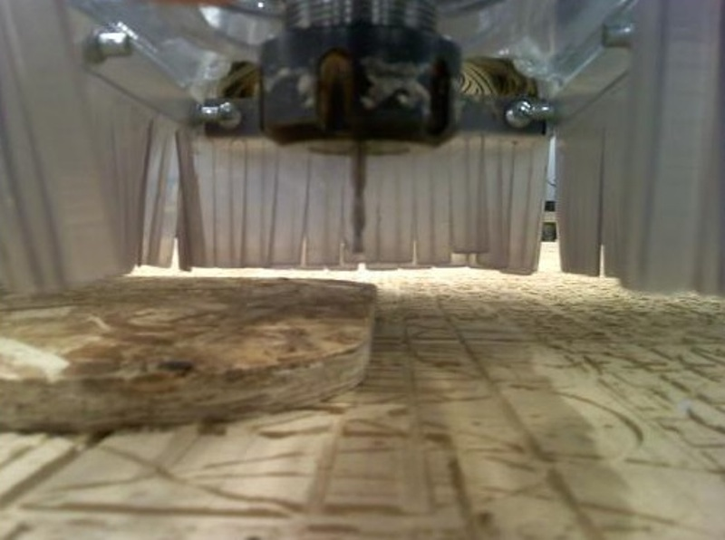

In the Shopbot console: go to the “Zero” menu, and run “Zero [2] axes (X & Y)”
In the red window, the position should now say .000 for X and Y.

11.  We must set the spindle speed manually.  There is a gray controller box on the side of the Shopbot (V7-4X)  Use the arrows to set your desired spindle speed.  In our case, this is 12.0 which means 12000 RPM.

12.  Shopbot Console: File: Part File Load.  Open your sbp file. 

At this point:  Turn on Dust Collector.

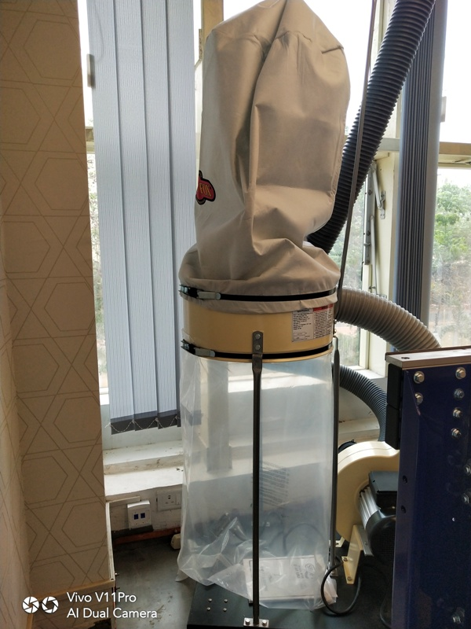

Screen is: Fill-In sheet for [FP] Command.  Click START in the lower right corner. 

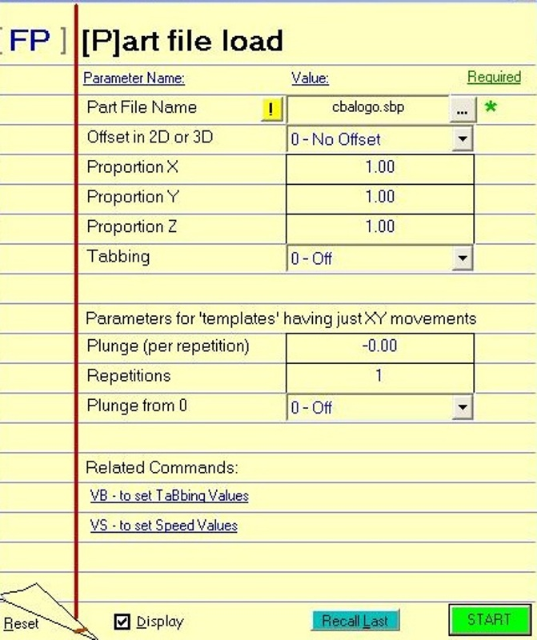

Box says Continue, click OK.   
STOP.
The screen now says Starting Router/Spindle. 
When you hit OK, the Shopbot will start moving regardless of if you’ve started your spindle.  Before you hit OK, you must start the spindle.

To start the spindle: On the yellow control box with the big red button and smaller blue and green buttons, hit the green button to start the spindle.

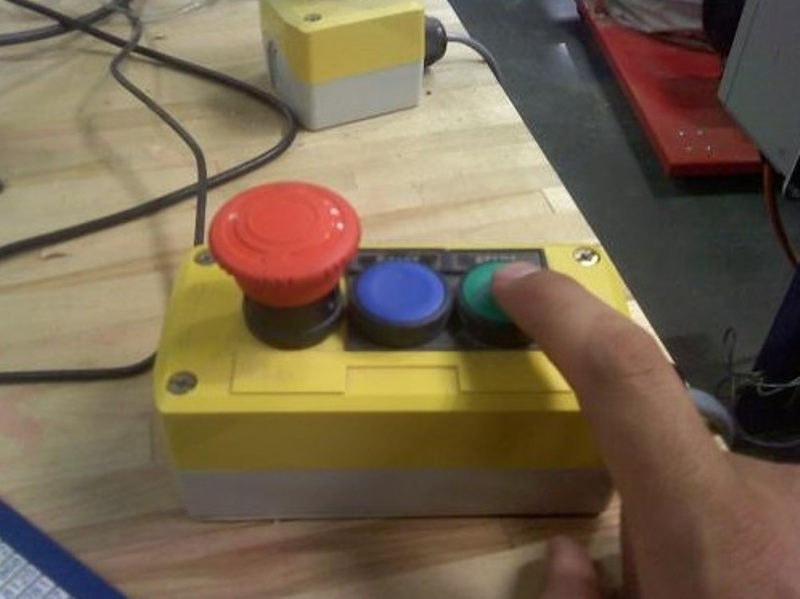

You may now click Ok to begin cutting.  Have your hand near the big red emergency stop button on the yellow control box, because if something looks wrong with the cutting, you need to stop it before anything gets damaged.

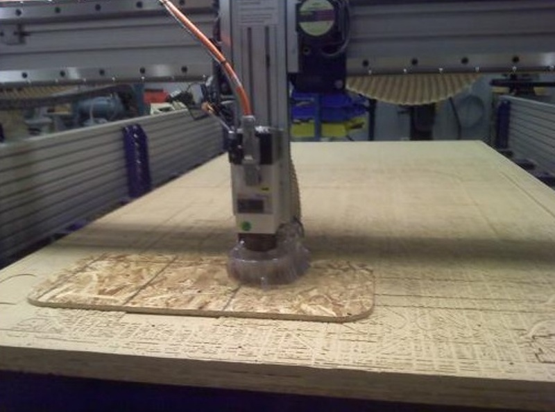

If nothing is wrong, your part will be cut out now.

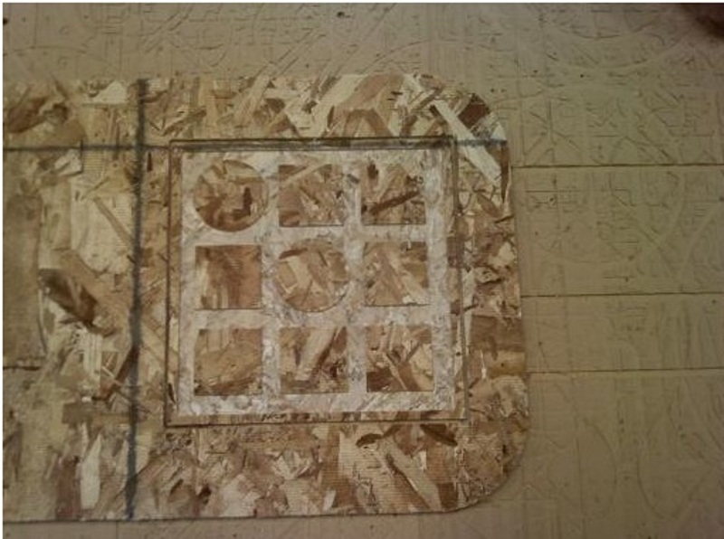

After, remove the screws, and vacuum up all scrap and dust created by your job.  You have a fancy computer cut part now!

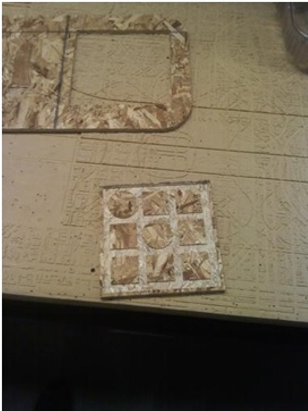

**Waw**

[Home](https://github.com/deepak2145/fabzero)
