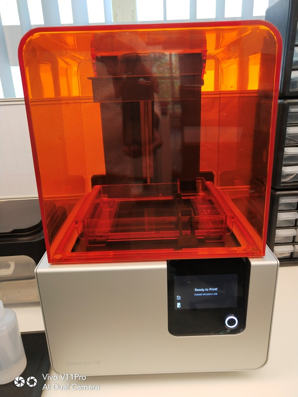
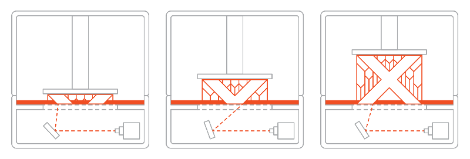
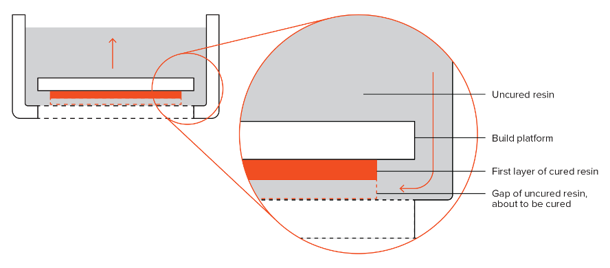
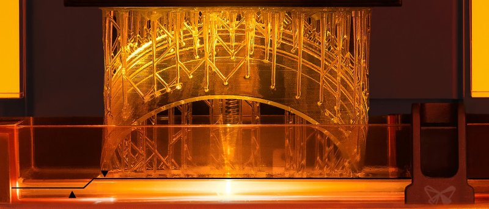
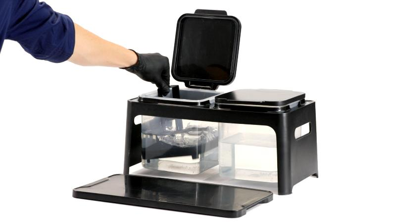
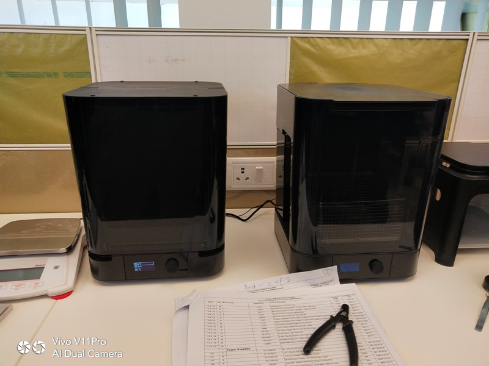
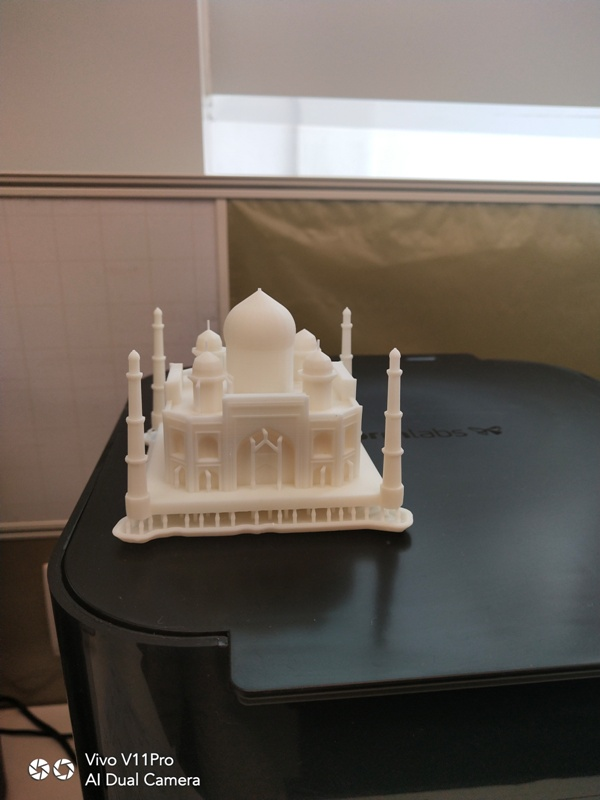

## This is SLA 3d Printer

**First We will understand what is SLA.**

Stereolithography (SLA) is an additive manufacturing process that belongs to the Vat Photopolymerization family. In SLA, an object is created by selectively curing a polymer resin layer-by-layer using an ultraviolet (UV) laser beam. The materials used in SLA are photosensitive thermoset polymers that come in a liquid form.

SLA is famous for being the first 3D Printing technology: its inventor patented the technology back in 1986. If parts of very high accuracy or smooth surface finish are needed, SLA is the most cost-effective 3D printing technology available. Best results are achieved when the designer takes advantage of the benefits and limitations of the manufacturing process.

SLA has many common characteristics with Direct Light Processing (DLP), another Vat Photopolymerization 3D printing technology. For simplicity, the two technologies can be treated as equals.

Following is the 3D SLA printing process :-

**How does SLA work?**

Here is how the SLA fabrication process works:

1) The build platform is first positioned in the tank of liquid photopolymer, at a distance of one layer height for the surface of the liquid.

2) Then a UV laser creates the next layer by selectively curing and solidifying the photopolymer resin. The laser beam is focused in the predetermined path using a set of mirrors, called galvos. The whole cross sectional area of the model is scanned, so the produced part is fully solid.

3) When a layer is finished, the platform moves at a safe distance and the sweeper blade re-coats the surface. The process then repeats until the part is complete.

4) After printing, the part is in a green, no-fully-cured state and requires further post processing under UV light if very high mechanical and thermal properties are required.

Photo means 'light' and polymers are formed by amalgamation of many molecules (monomers). A photopolymer is a type of polymer that changes its physical properties when it is exposed to light. Photopolymers are  very popular and popular build material used by 3D printers. The liquid resin is solidified through a process called photopolymerization: during solidification, the monomer carbon chains that compose the liquid resin are activated by the light of the UV laser and become solid, creating strong unbreakable bonds between each other. The photopolymerization process is irreversible and there is no way to convert the SLA parts back to their liquid form: when heated, they will burn instead of melting. This is because the materials that are produced with SLA are made of thermoset polymers, as opposed to the thermoplastics that FDM uses.

**Printer Parameters**

In SLA systems, most print parameters are fixed by the manufacturer and cannot be changed. The only inputs are the layer height and part orientation (the latter determines support location).

The typical layer height in SLA ranges between 25 and 100 microns. Lower layer heights capture curved geometries more accurately but increase the build time (and cost) and the probability of a failed print. A layer height of 100 microns is suitable for most common applications.

The build size is another parameter that is important for the designer. The build size depends on the type of SLA machine. There are two main SLA machine setups: the top-down orientation and the bottom-up orientation.This printer prints from top to bottom and 3d object is created intverted as shown in image below

The bottom-up SLA printers place the light source under the resin tank (see figure above) and the part is built facing upside down. The tank has a transparent bottom with a silicone coating that allows the light of the laser to pass through but stops the cured resin from sticking to it. After every layer, the cured resin is detached from the bottom of the tank, as the build platform moves upwards. This is called the peeling step.

It How looks when the 3d printing is in progress.the object is created upside down.

**Post Processing**

## Cleaning

Once the print process is completed, the build platform can be removed from the printer. The printed object then require rinsing in isopropyl alcohol (IPA) to remove any uncured resin from their surface as shown in image.dont forget to wear saftey gloves.

## Curing

After cleaning the 3d object is cured in the ultravoilet light in the instrument for 30 min and then it is taken out.The cleaning and curing devices are shown below:-

**I printed the 3D Tajmahal prototype with this printer which is shown below:-**

